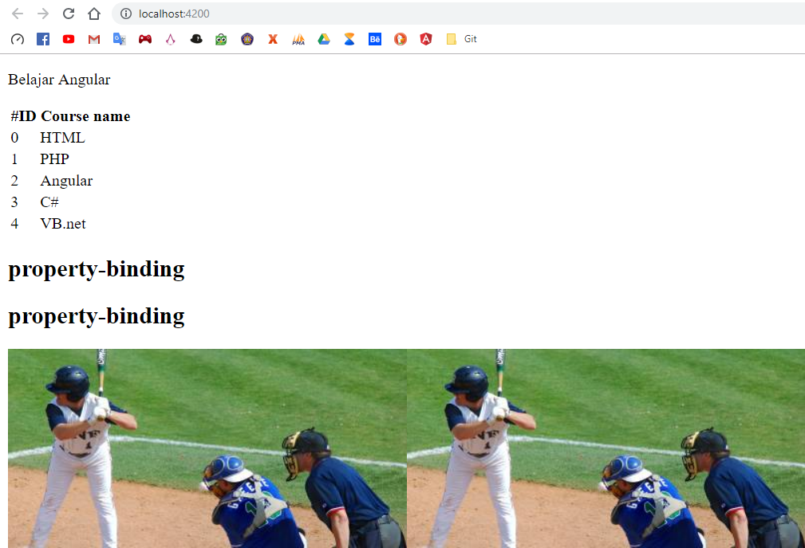
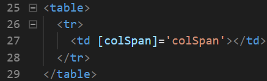

# 04. Displaying Data And Binding Data

Praktikum - Bagian 1: Component Basic
---

* Buka file **courses.component.ts** kemudian tambahkan code seperti berikut:

```typescript
import { Component, OnInit } from '@angular/core';
import { CoursesService } from '../courses.service';

@Component({
  selector: 'app-courses',
  templateUrl: './courses.component.html',
  styleUrls: ['./courses.component.css']
})
export class CoursesComponent implements OnInit {

  Title = 'Belajar Angular';
  Courses;

  binding = 'property-binding';
  imageUrl = 'http://lorempixel.com/400/200';

  constructor(private service:CoursesService) { 
    this.Courses = service.getCourses;
  }

  ngOnInit() {
  }

}

```

* Buka file **courses.component.html** lalu tambahkan code seperti berikut:

```html
<p>
  {{ Title }}
</p>
<table>
  <thead>
    <th>
      #ID
    </th>
    <th>Course name</th>
  </thead>
  <tbody>
    <tr *ngFor = "let Course of Courses">
    <td>{{ Course.id }}</td>
    <td>{{ Course.name }}</td>
    </tr>
  </tbody>
</table>

<h2>{{ binding }}</h2>
<h2 [textContent]='binding'></h2>


```

* Lalu hasilnya seperti ini:




Praktikum - Bagian 2: Attribute Binding
---

* Buka file **courses.component.ts** kemudian tambahkan property colspan dibawah line imageUrl seperti berikut:


* Buka file **courses.component.html** kemudian menambah code berikut:



* Lalu error akan muncul seperti ini:


* Menambahkan code untuk memperbaiki error seperti berikut:


* Kemudian menambah button pada file **courses.component.html** seperti berikut:


* Hasilnya seperti berikut:


Praktikum - Bagian 3: Class Bagian
---

