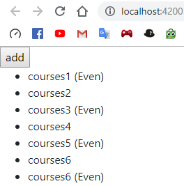
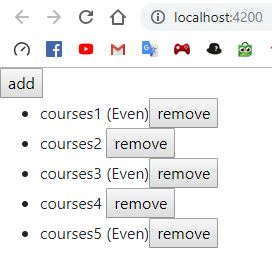
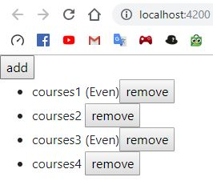
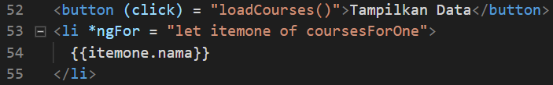
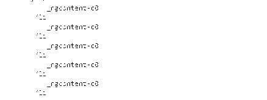
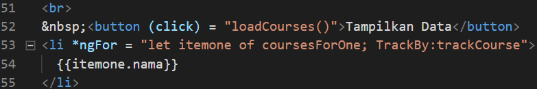

# 05. Directive

ngIf
---

* Buka file **app.component.ts** lalu tambahkan code berikut:

```typescript
  title = 'belajar-angular';
  courses = [1,2];
```

* Buka file **app.component.html** lalu edit seperti berikut:

```html
<div *ngIf = "courses.length > 0">
  list of courses
</div>

<div *ngIf = "courses.length == 0">
  no courses yet
</div>

<router-outlet></router-outlet>
```

* Hasilnya seperti berikut:


* Pada array pada file **app.component.ts** dikosongkan indeksnya seperti berikut

 `courses = [];`

* Hasilnya seperti berikut:


* Buka file **app.component.html** edit codenya seperti berikut:

```html
<div *ngIf = "courses.length >  0; else noCourses">
  list of courses
</div>

<ng-template #noCourses>
  no course yet
</ng-template>
```

* Menjalankan localhost dengan kondisi array kosong

 `courses = [];`

* Hasilnya seperti berikut:


* Kemudian isi dengan array

 `courses = [1,2];`

* Hasilnya seperti berikut:


* Buka file **app.component.html** edit kodenya seperti berikut:

```html
<div *ngIf = "courses.length >  0; then coursesList else noCourses"></div>
<ng-template #coursesList>
  list of courses
</ng-template>
```

* Menjalankan localhost dengan kondisi array pada file **app.component.ts** kosong

 `courses = [];`

* Hasilnya seperti berikut:


* Kemudian isi dengan array

 `courses = [1,2];`

* Hasilnya seperti berikut:


Hidden Property
---

* Buka file **app.component.html** kemudian tambahkan code berikut:

```html
<div hidden>
  list courses list
</div>
<div>
  no courses yet
</div>

<router-outlet></router-outlet>
```

* Hasilnya seperti berikut:


* Edit code pada file **app.component.html** seperti berikut:

```html
<div [hidden] = "courses.length == 0">
  list courses list
</div>
<div [hidden] = "courses.length > 0">
  no courses yet
</div>
```

* Isi array pada file **app.component.ts**

 `courses = [1,2];`

* Hasilnya seperti berikut:


* Jika dilihat pada inspect element maka akan terlihat **property hidden** tidak terdapat **kondisi true ataupun false**


* Berbeda jika menggunakan **ngIf** terdapat **bindings** dengan nilai **false**


ngSwitchCase
---

* Buka file **app.component.html** lalu edit codenya seperti berikut:


* Buka file **app.component.ts** lalu tambahkan code seperti berikut:

` viewMode = 'map'; `

* Hasilnya seperti berikut:


ngFor
---

* Buka file **app.component.ts** kemudian menambahkan code berikut di method export class:


* Buka file **app.component.html** kemudian menambahkan directive ngFor pada element li:


* Hasilnya seperti berikut:


* Memberi tanda pada index yang bernilai ganjil dengan menggunakan isEven


* Hasilnya seperti berikut:


* Menambahkan method `onAdd` pada file **app.component.ts**

```typescript
onAdd(){
    this.coursesFor.push({id:6,name:'courses6'})
  }
```

* Menambahkan button add pada file **app.component.html**

```html
<button (click)="onAdd()">add</button>
```

* Hasilnya seperti berikut (button add):


* Hasilnya seperti berikut (klik button add):



* Menambahkan method ` onRemove() ` di bawah method `onAdd()`:

```typescript
  onRemove(item) {
    console.log(item);
    let index = this.coursesFor.indexOf(item);
    console.log(index);
    this.coursesFor.splice(index, 1);
  }
```

* Menambahkan button remove pada **app.component.html**

```html
    <button (click) = "onRemove(item)">remove</button>
```

* Hasilnya seperti berikut:



* Courses 5 terhapus setelah meng-klik remove:



* Menambahkan method `onChange()` pada **app.component.ts**

```typescript
  onChange(item) {
    item.name = 'Updated';
  }
```

* Mengganti button remove dengan update pada **app.component.html**

`<button (click) = "onChange(item)">update</button>`

ngFor dan trackby
---

* Membuat property `coursesForOne` dan method `loadCourses()` pada **app.component.ts**


* Membuat button **Tampilkan Data** pada **app.component.html**



* Hasilnya seperti ini


* Muncul tag ul jika **Tampilkan Data** di klik 


* Membuat method `trackCourse()` pada **app.component.ts**

```typescript
  trackCourse(index,itemone) {
    return itemone ? itemone.id : undefined;
  }
```

* Meng-edit ngFor pada **app.component.html**



The Leading Asterisk
---

* Menambahkan code pada **app.component.html**

```html
<div *ngIf="courses.length > 0">
  list of courses
</div>
```

* Menambahkan `<ng-template>` pada **app.component.html**



ngClass
---

* Membuat 2 class binding ` fa-star ` dan ` fa-star-o `


* Membuat atrribute directive class untuk fa


Custom Directive
---

