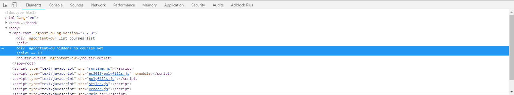

# 05. Directive

ngIf
---

* Buka file **app.component.ts** lalu tambahkan code berikut:

```typescript
  title = 'belajar-angular';
  courses = [1,2];
```

* Buka file **app.component.html** lalu edit seperti berikut:

```html
<div *ngIf = "courses.length > 0">
  list of courses
</div>

<div *ngIf = "courses.length == 0">
  no courses yet
</div>

<router-outlet></router-outlet>
```

* Hasilnya seperti berikut:


* Pada array pada file **app.component.ts** dikosongkan indeksnya seperti berikut

 `courses = [];`

* Hasilnya seperti berikut:


* Buka file **app.component.html** edit codenya seperti berikut:

```html
<div *ngIf = "courses.length >  0; else noCourses">
  list of courses
</div>

<ng-template #noCourses>
  no course yet
</ng-template>
```

* Menjalankan localhost dengan kondisi array kosong

 `courses = [];`

* Hasilnya seperti berikut:


* Kemudian isi dengan array

 `courses = [1,2];`

* Hasilnya seperti berikut:


* Buka file **app.component.html** edit kodenya seperti berikut:

```html
<div *ngIf = "courses.length >  0; then coursesList else noCourses"></div>
<ng-template #coursesList>
  list of courses
</ng-template>
```

* Menjalankan localhost dengan kondisi array pada file **app.component.ts** kosong

 `courses = [];`

* Hasilnya seperti berikut:


* Kemudian isi dengan array

 `courses = [1,2];`

* Hasilnya seperti berikut:


Hidden Property
---

* Buka file **app.component.html** kemudian tambahkan code berikut:

```html
<div hidden>
  list courses list
</div>
<div>
  no courses yet
</div>

<router-outlet></router-outlet>
```

* Hasilnya seperti berikut:


* Edit code pada file **app.component.html** seperti berikut:

```html
<div [hidden] = "courses.length == 0">
  list courses list
</div>
<div [hidden] = "courses.length > 0">
  no courses yet
</div>
```

* Isi array pada file **app.component.ts**

 `courses = [1,2];`

* Hasilnya seperti berikut:


* Jika dilihat pada inspect element maka akan terlihat **property hidden** tidak terdapat **kondisi true ataupun false**



* Berbeda jika menggunakan **ngIf** terdapat **bindings** dengan nilai **false**


ngSwitchCase
---

* Buka file **app.component.html** lalu edit codenya seperti berikut:


* Buka file **app.component.ts** lalu tambahkan code seperti berikut:

` viewMode = 'map'; `

* Hasilnya seperti berikut:


ngFor
---

* Buka file **app.component.ts** kemudian tambahkan code berikut di method export class:


