# 06. Template-Driven Forms

Membuat Form Bootstrap
---

* Membuat component bernama contact

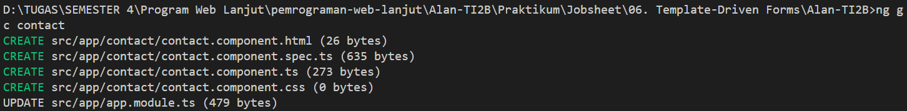

* Buka file **contact.component.html** kemudian menambahkan code berikut:

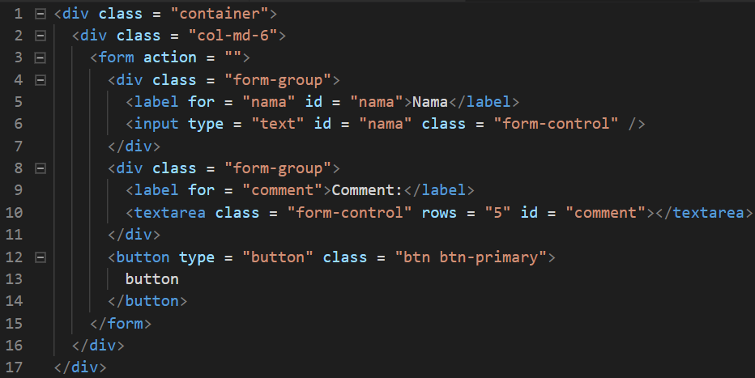

* Buka file **app.component.html** kemudian menambahkan code berikut:

```html
<app-contact></app-contact>
<router-outlet></router-outlet>
```

* Hasilnya seperti berikut:


Macam-macam Form
---

* Meng-generate 2 buah component dengan nama **reactive-form** dan **template-driven**


* Buka file **reactive-form.component.html** dan membuat code seperti berikut:

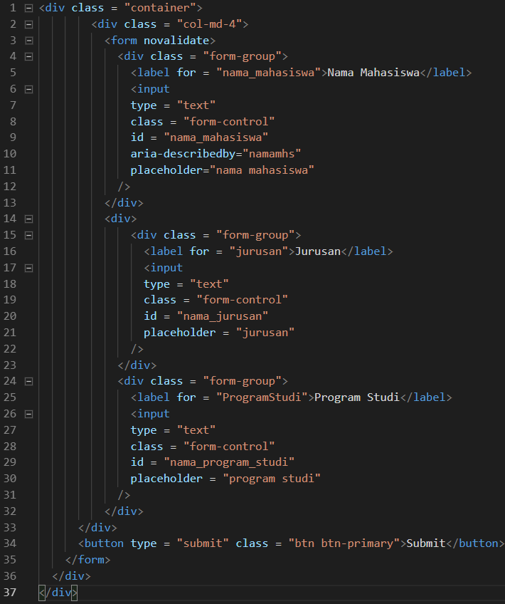

* Buka file **app.component.html** kemudian menambahkan code berikut:

```html
<app-reactive-form></app-reactive-form>
<router-outlet></router-outlet>
```

* Hasilnya seperti berikut:

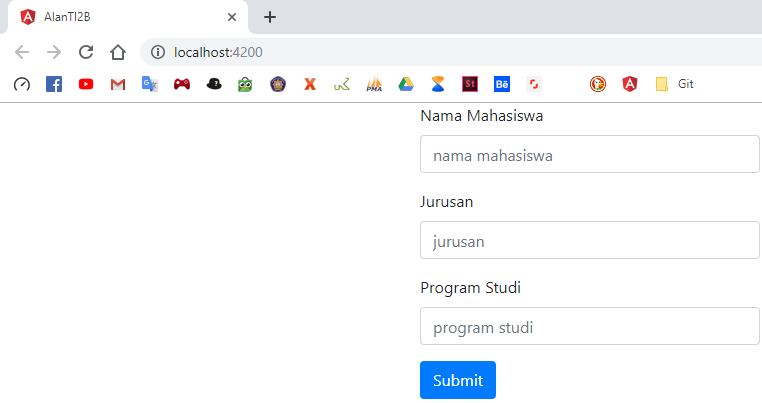

* Membuat interface dengan nama **mahasiswa.interface.ts** dan menambahkan code berikut

```typescript
export interface mahasiswa {
    nama_mhs:string;
    pendidikan:{
        nama_jurusan:string;
        nama_prodi:string;
    }
}
```

* Menambahkan ` ReactiveFormsModule ` dan ` FormsGroup ` pada **app.module.ts**

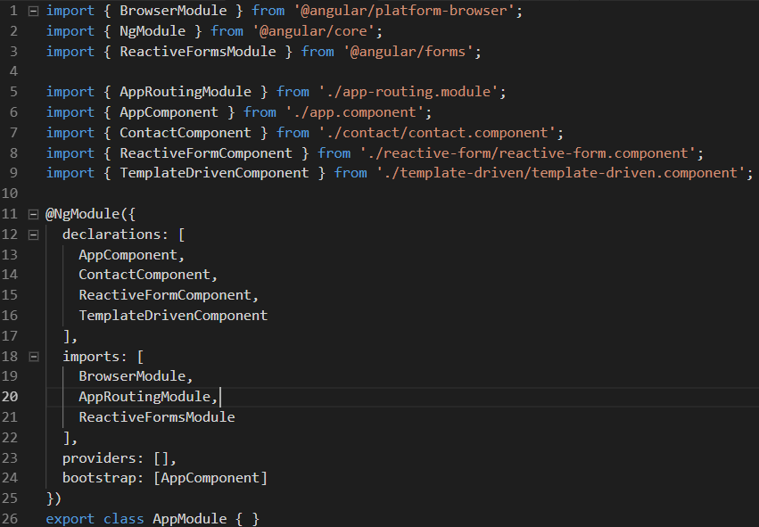

* Buka file **reactive-forms.component.ts** kemudian menambahkan code seperti berikut:

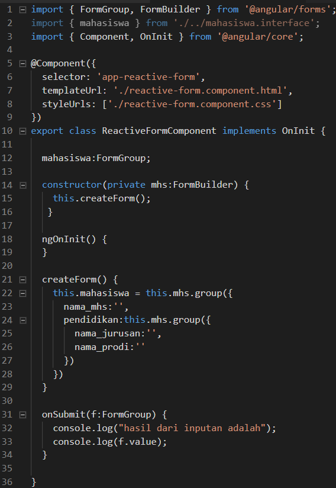

* Buka file **reactive-form.component.html** kemudian ubah codenya seperti berikut:

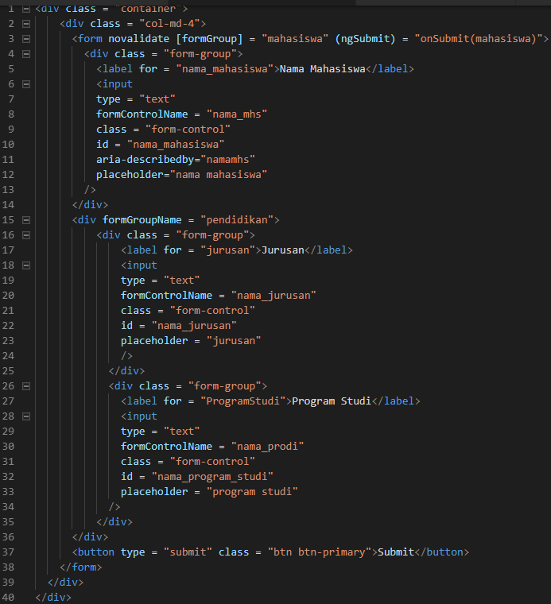


* Hasilnya seperti berikut:


* Buka file **app.module.ts** kemudian menambahkan code seperti berikut:

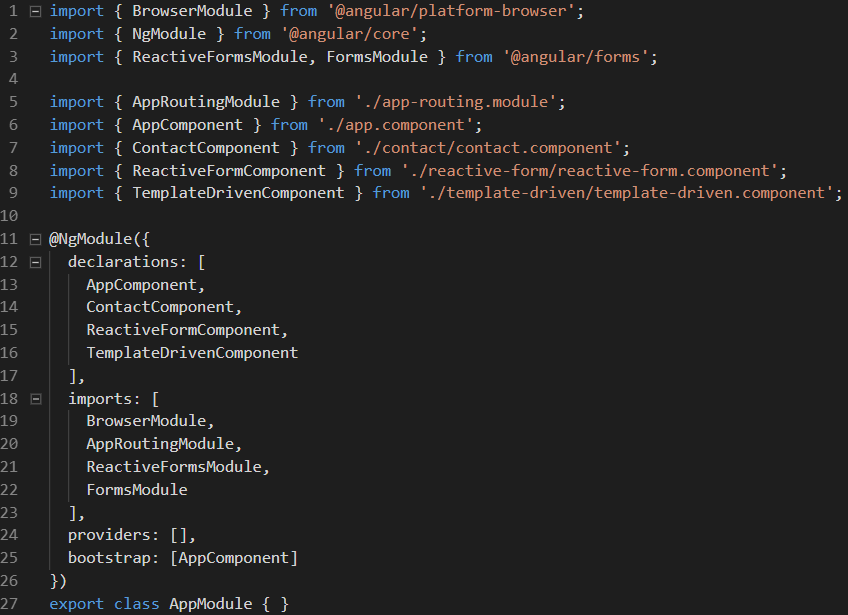

* Buka file **template-driven.component.ts** kemudian menambahkan code seperti berikut:


* Buka file **template-driven.component.ts** kemudian menambahkan method ` onSubmit() `:

```typescript
  onSubmit() {
    console.log("hasil inputan:");
    console.log(this.mahasiswa)
  }
```

* Buka file **template-driven.component.html** kemudian menambahkan code seperti berikut:

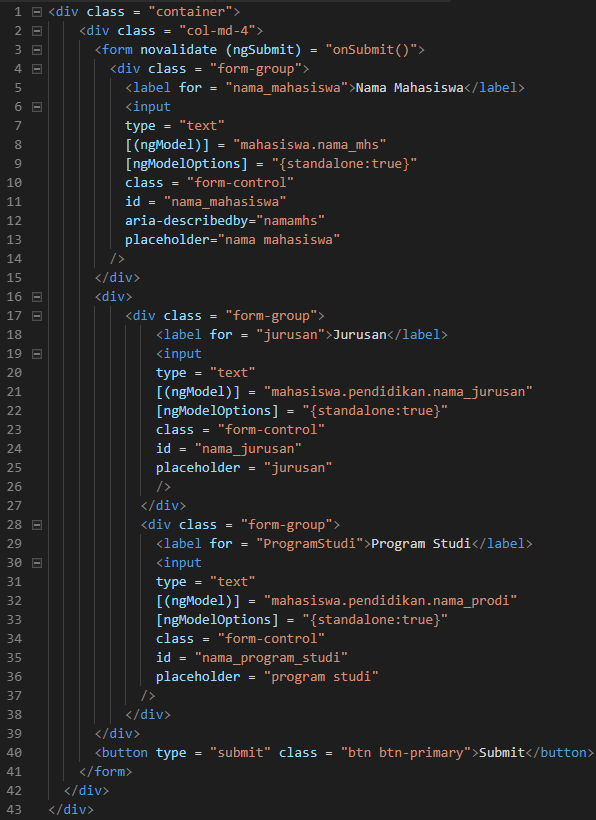

* Buka file **app.component.html** kemudian ubah codenya seperti berikut:

```html
<app-template-driven></app-template-driven>
<router-outlet></router-outlet>
```

* Hasilnya seperti berikut:


ngModel
---

* Buka file **contact.component.ts** kemudian menambahkan code seperti berikut:

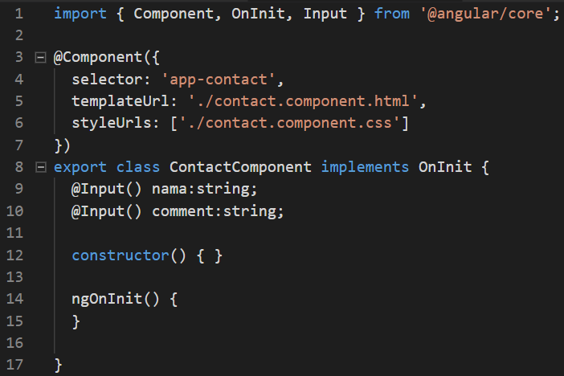

* Buka file **contact.component.html** kemudian ubah codenya seperti berikut:


* Hasilnya seperti berikut:


* Buka file **contact.component.html** kemudian menambahkan code seperti berikut:

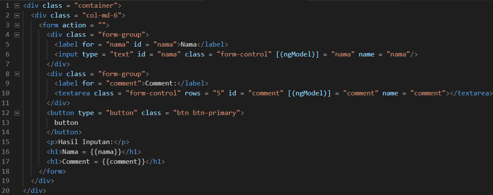

* Hasilnya seperti berikut:

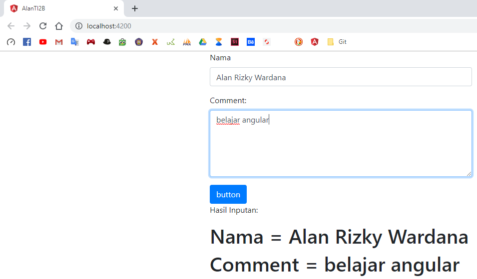

* Buka file **contact.component.ts** tambahkan code seperti berikut:

```typescript
  export class ContactComponent {
    log(x) {
      console.log(x);
    }
  }
```

* Buka file **contact.component.html** kemudian ubah codenya seperti berikut:

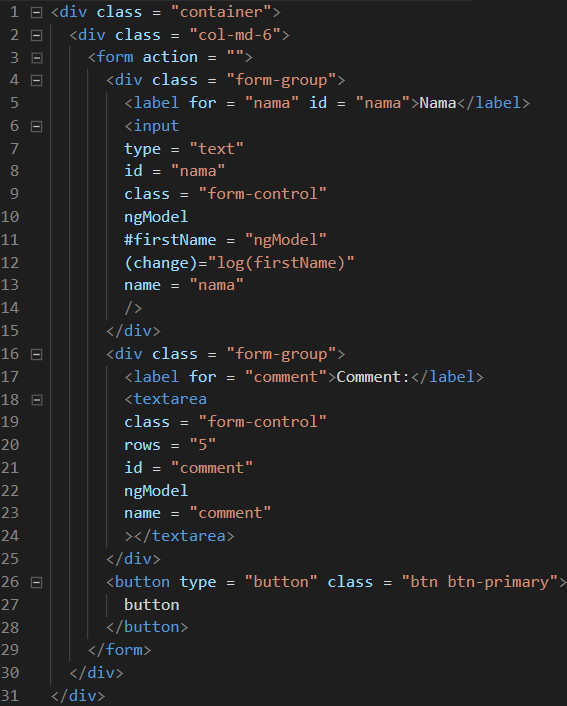

* Hasilnya seperti berikut:


