# 06. Template-Driven Forms

Membuat Form Bootstrap
---

* Membuat component bernama contact


* Buka file **contact.component.html** kemudian menambahkan code berikut:


* Buka file **app.component.html** kemudian menambahkan code berikut:

```html
<app-contact></app-contact>
<router-outlet></router-outlet>
```

* Hasilnya seperti berikut:

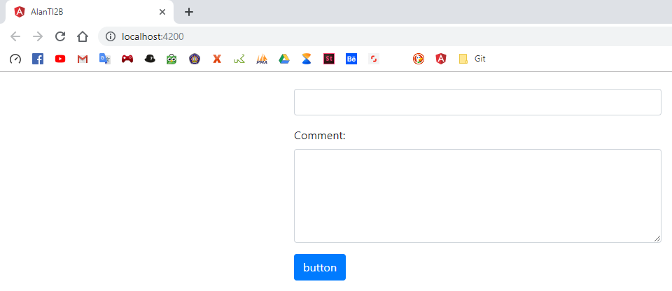

Macam-macam Form
---

* Meng-generate 2 buah component dengan nama **reactive-form** dan **template-driven**


* Buka file **reactive-form.component.html** dan membuat code seperti berikut:


* Buka file **app.component.html** kemudian menambahkan code berikut:

```html
<app-reactive-form></app-reactive-form>
<router-outlet></router-outlet>
```

* Hasilnya seperti berikut:


* Membuat interface dengan nama **mahasiswa.interface.ts** dan menambahkan code berikut

```typescript
export interface mahasiswa {
    nama_mhs:string;
    pendidikan:{
        nama_jurusan:string;
        nama_prodi:string;
    }
}
```

* Menambahkan ` ReactiveFormsModule ` dan ` FormsGroup ` pada **app.module.ts**


* Buka file **reactive-forms.component.ts** kemudian menambahkan code seperti berikut:


* Buka file **reactive-form.component.html** kemudian ubah codenya seperti berikut:


* Hasilnya seperti berikut:

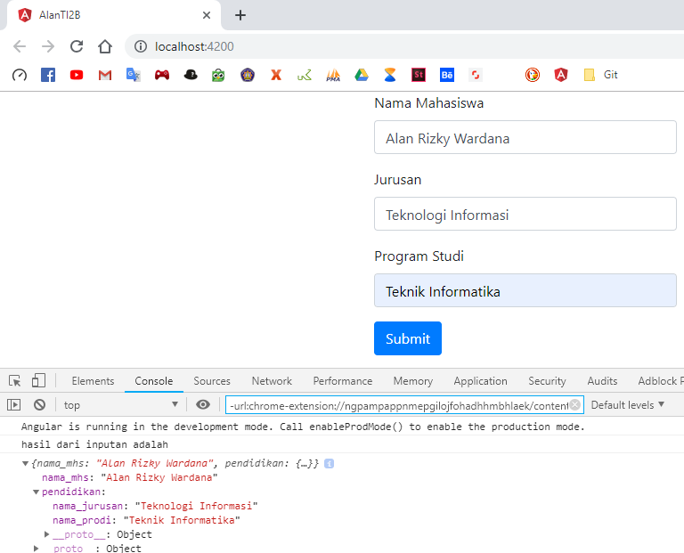

* Buka file **app.module.ts** kemudian menambahkan code seperti berikut:


* Buka file **template-driven.component.ts** kemudian menambahkan code seperti berikut:


* Buka file **template-driven.component.ts** kemudian menambahkan method ` onSubmit() `:

```typescript
  onSubmit() {
    console.log("hasil inputan:");
    console.log(this.mahasiswa)
  }
```

* Buka file **template-driven.component.html** kemudian menambahkan code seperti berikut:


* Buka file **app.component.html** kemudian ubah codenya seperti berikut:

```html
<app-template-driven></app-template-driven>
<router-outlet></router-outlet>
```

* Hasilnya seperti berikut:

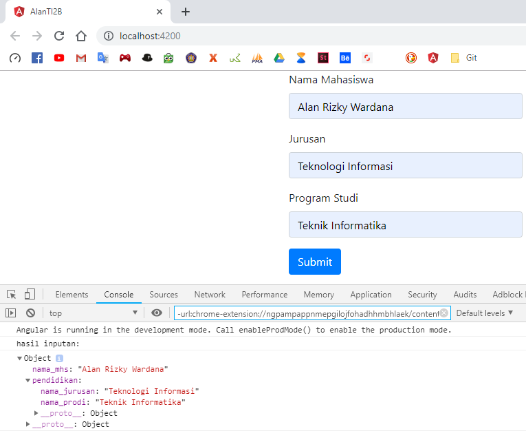

ngModel
---

* Buka file **contact.component.ts** kemudian menambahkan code seperti berikut:


* Buka file **contact.component.html** kemudian ubah codenya seperti berikut:


* Hasilnya seperti berikut:


* Buka file **contact.component.html** kemudian menambahkan code seperti berikut:


* Hasilnya seperti berikut:


* Buka file **contact.component.ts** tambahkan code seperti berikut:

```typescript
  export class ContactComponent {
    log(x) {
      console.log(x);
    }
  }
```

* Buka file **contact.component.html** kemudian ubah codenya seperti berikut:


* Hasilnya seperti berikut:

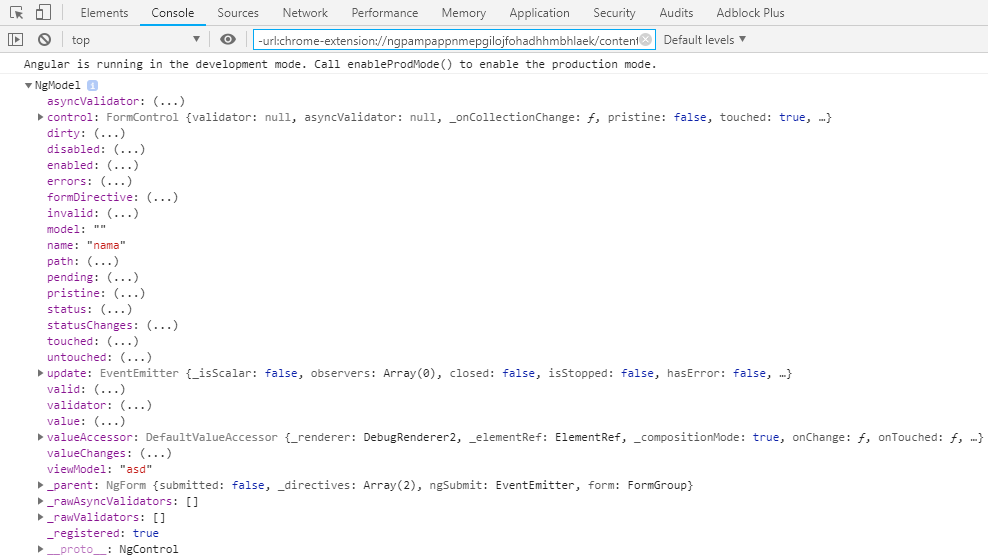

Validasi
---

* Buka file **contact.component.html** kemudian menambahkan code berikut:

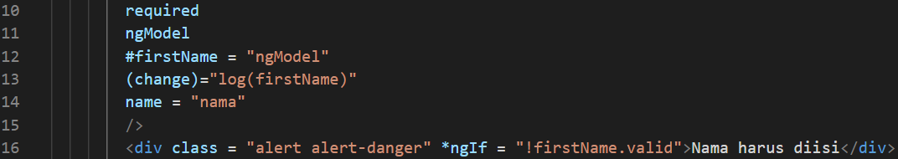


* Hasilnya seperti berikut:

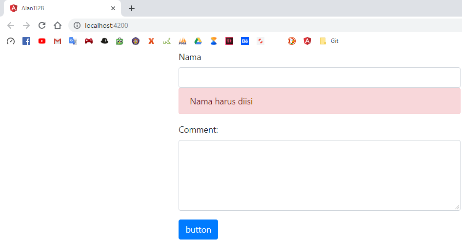

* Buka file **contact.component.html** kemudian menambahkan code berikut:

```html
        <div 
        class = "alert alert-danger" 
        *ngIf = "firstName.touched &&!firstName.valid"
        >
          Nama harus diisi
        </div>
```

* Hasilnya seperti berikut, jika di klik maka akan muncul alert:


Spesific validasi error
---

* Buka file **contact.component.html** kemudian menambahkan beberapa code berikut:


* Hasilnya seperti berikut:


* Hasil inspect element:

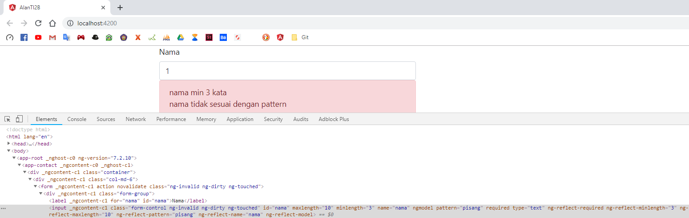

Stylish Invalid input field
---

* Buka file **contact.component.css** kemudian tambahkan code berikut:

```css
.form-control.ng-touched.ng-invalid {
    border: 4px solid red;
}
```

* Hasilnya seperti berikut:

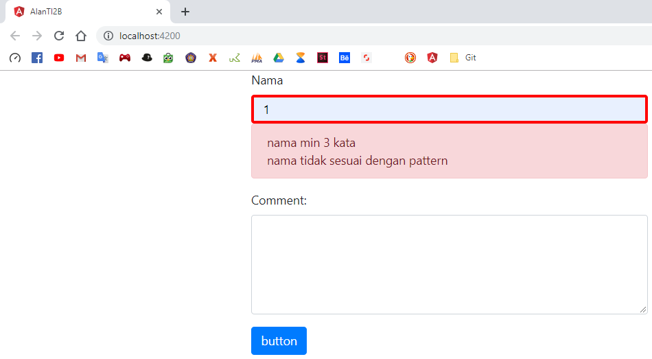

ngForm
---

* Buka file **contact.component.ts** kemudian menambahkan sebuah method submit seperti berikut:


* Buka file **contact.component.html** dan membuat variable template `ngForm` atau property `ngForm` dengan nama `(#form)`.

```html
    <form #form = "ngForm" (ngSubmit) = "submit(form)">
```

* Pada button rubah codenya menjadi seperti berikut

```html
      <button type = "submit" class = "btn btn-primary">
```

* Hasilnya seperti berikut:

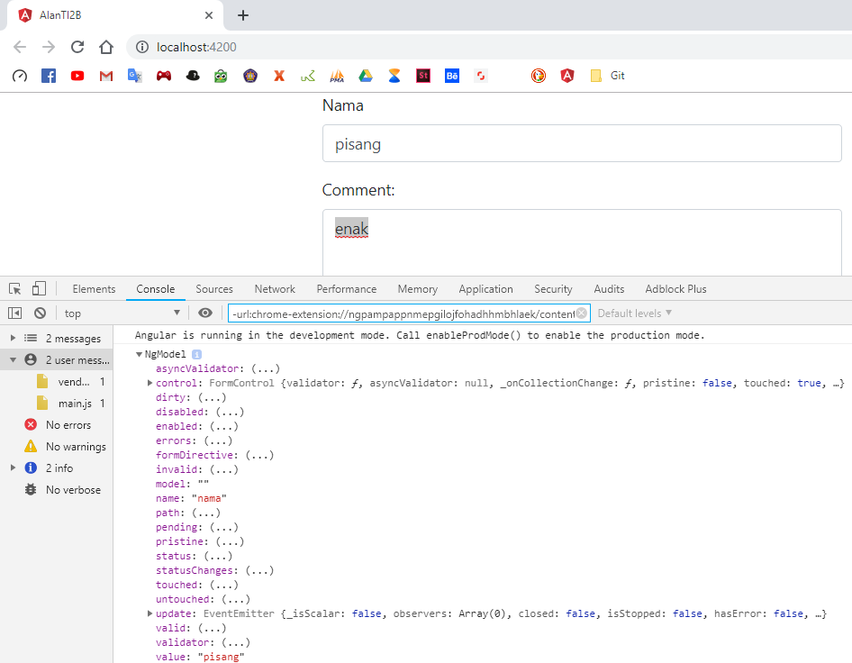

ngModelGroup
---

* Buka file **contact.component.html** kemudian menambahkan code seperti berikut:

```html
<div ngModelGroup = "contact" #contact = "ngModelGroup">
  <div *ngIf = "!contact.valid">contoh validasi pada ngModelGroup</div>
```

Disabling the submit button
---

* Buka file **contact.component.html** kemudian tambahkan code berikut pada tag button:

```html
      <button type = "submit" [disabled] = "!form.valid" class = "btn btn-primary">
```

* Hasilnya seperti berikut:


* Jika nama diisi maka button akan enable:


Bekerja dengan check box
---

* Buka file **contact.component.html** dan menambahkan code `check box` seperti pada berikut:

```html
      <div class = "checkbox">
        <label for = "">
          <input type = "checkbox" ngModel name = "isSubscribe">Subscribe jika ingin berlangganan
        </label>
      </div>
      <p>
```

* Hasilnya seperti berikut:

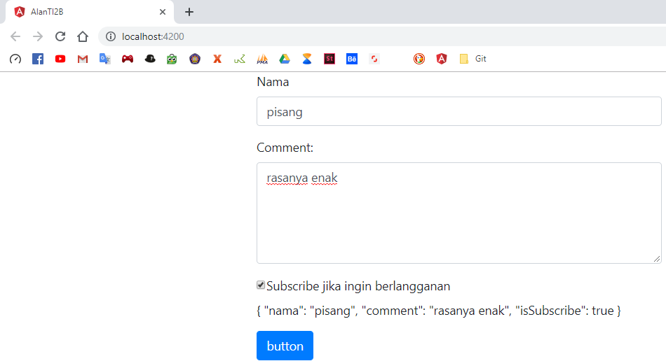

Bekerja dengan drop-down list
---

* Buka file **contact.component.ts** kemudian menambahkan method `contactMethods`

```typescript
    contactMethods=[
      {id:1, name:'email'},
      {id:2, name:'phone'}
    ]
```

* Buka file **contact.component.html** kemudian menambahkan code seperti berikut:


* Hasilnya seperti berikut:


* Menggunakan `[ngValue]`

```html
          <option *ngFor = "let method of contactMethods" [ngValue] = "method">{{method.name}}</option>
```

* Hasilnya seperti berikut:

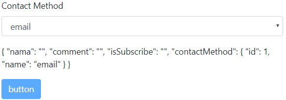

* Menggunakan `multiple`

```html
        <select multiple ngModel name = "contactMethod" id = "contactMethod" class = "form-control">
```

* Hasilnya seperti berikut:


Bekerja dengan radio button
---

* Buka file **contact.component.html** dan menambahkan code seperti berikut:


* Hasilnya seperti berikut:

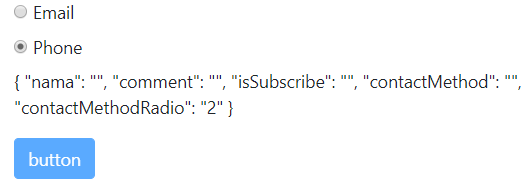

* Tidak menggunakan `ngModel`

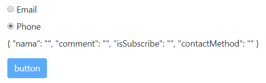

* Menggunakan `ngFor`

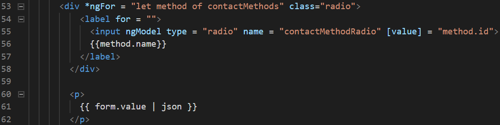

* Hasilnya seperti berikut:

