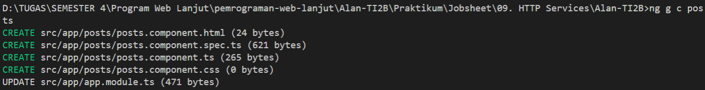
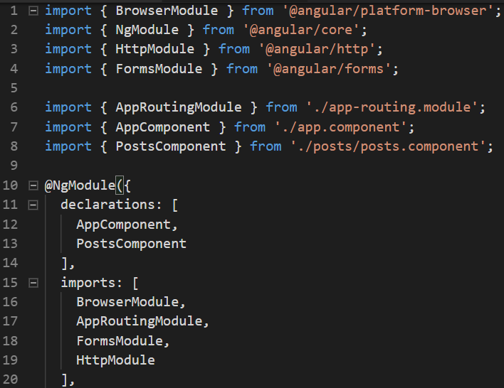
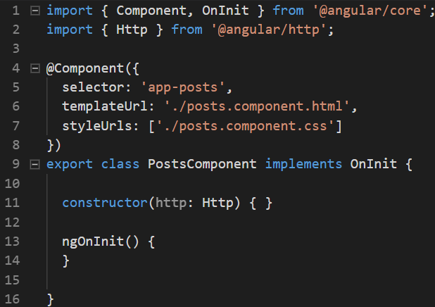
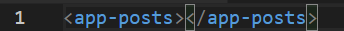
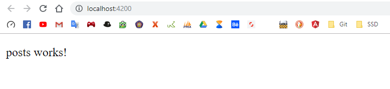
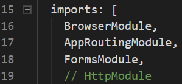
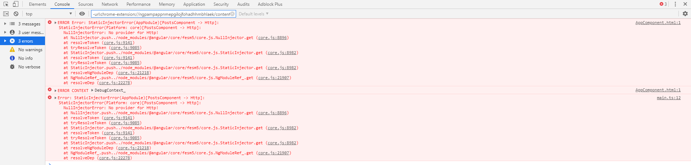
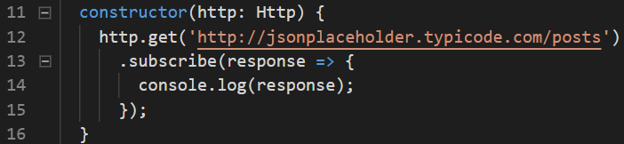
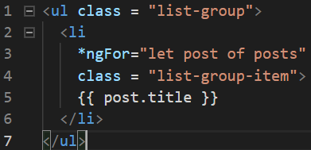
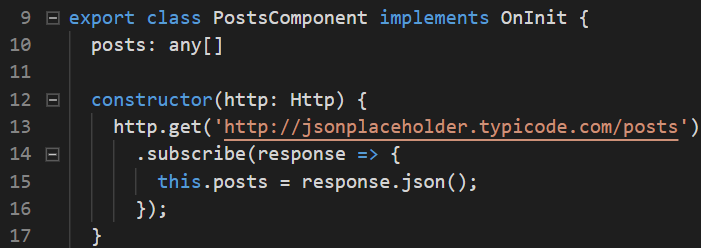

# 09. HTTP Services

Praktikum - Bagian 1: JSONPlaceHolder
---

* Membuka website http://jsonplaceholder.typicode.com/

Praktikum - Bagian 2: Getting Data
---

* Membuat component baru dengan nama posts dengan perintah `ng g c posts`

* Import HTTP Module pada file **app.module.ts**

* Memodifikasi file **posts.component.ts** menjadi seperti berikut:

* Memodifikasi file **posts.component.html** menjadi seperti berikut:

* Hasilnya seperti berikut:

* Meng-comment `HttpModule` pada file **app.module.ts**

* Error akan muncul seperti berikut:

> Penjelasan karena `HttpModule` dihapus, maka provider akan mencari http module

* Memperbaiki code pada file **posts.component.ts** menjadi seperti berikut:

* Error akan muncul seperti berikut:

> Penjelasan karena `HttpModule` dihapus, maka provider akan mencari http module

* Memodifikasi file **posts.component.html** menjadi seperti berikut:

* Memodifikasi file **posts.component.ts** menjadi seperti berikut:

* Hasilnya seperti berikut:

* 