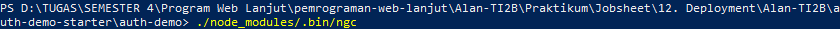
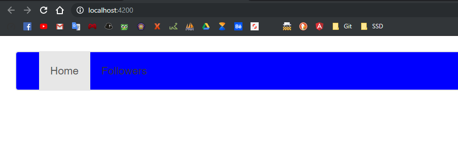
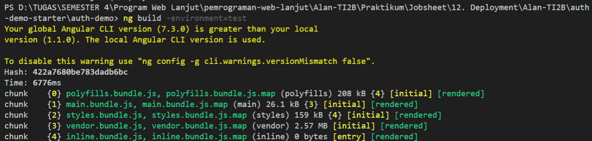
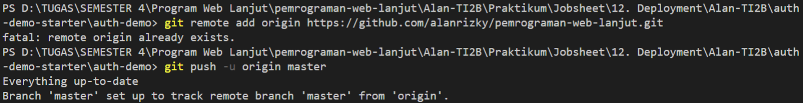

# 12. Deployment

Praktikum - Bagian 1: Preparing for Deployment
---

* Menjalankan perintah `./node_modules/.bin/ngc`

* Muncul folder dist yang akan mengcompile file ts

Praktikum - Bagian 2: Environments
---

* Buka file **environments.prod.ts** kemudian menambahkan code sebagai berikut:

* Buka file **environment.ts** kemudian ganti code menjadi sebagai berikut:

* Buka file **navbar.component.ts** kemudian menambahkan code sebagai berikut:

* Buka file **navbar.component.html** kemudian menambahkan code sebagai berikut:

* Hasilnya seperti berikut:

* Menduplikasi file **environment.test.ts**

* Membuka file **.angular-cli.json** kemudian menambahkan code sebagai berikut:

* Menjalankan dengan perintah sebagai berikut:

* Hasilnya seperti berikut:

Praktikum - Bagian 3: Deploying to Github Pages
---

* Melakukan git remote 

* 