# 03. Angular Fundamental

Praktikum - Bagian 1: Component Basic
---

* Membuat komponen dengan nama **courses** dengan cara ` ng g c courses `.
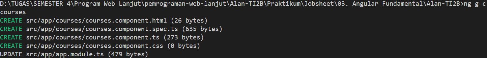

* Kemudian ke directory **src/app** kemudian buka file **app.component.html**.
* Edit isi file tersebut menjadi seperti berikut:

```html
<app-courses></app-courses>

<router-outlet></router-outlet>
```

* Kemudian jalankan menggunakan ` ng serve --open `

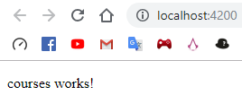

* Buka file **app.modules.ts** dan hapus ` coursecomponent ` pada ` declarations `.

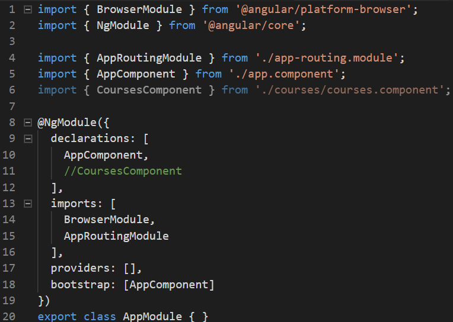

* Jalankan angular.
* Terdapat error bahwa **app-courses** merupakan elemen yang tidak diketahui.

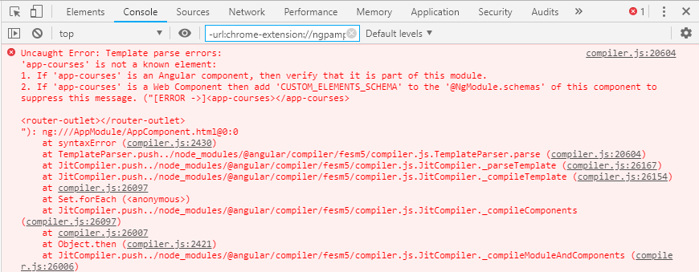

> **Penjelasan**: ` CoursesComponent ` merupakan elemen penting pada **NgModule**, jika dihapus maka angular tidak dapat menampilkan isi dari html.

Praktikum - Bagian 2: Templates
---

* Pindah direktori ke **../courses**.
* Buka file **courses.component.ts** kemudian tambahkan property baru dengan nama **title**.

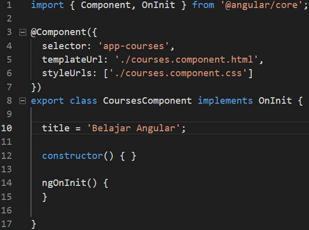

* Kemudian tambahankan string pada binding datanya. Buka file **courses.component.html**, dan tambahkan code seperti berikut:

```html
<p>
  courses works!
</p>
<p>
  {{"judulnya:" + title}}
</p>
```
* Hasilnya seperti berikut:

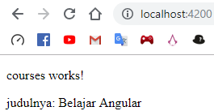

* Buka file **courses.component.ts** dan buat sebuah method dengan nama ` getTitle ` seperti berikut:

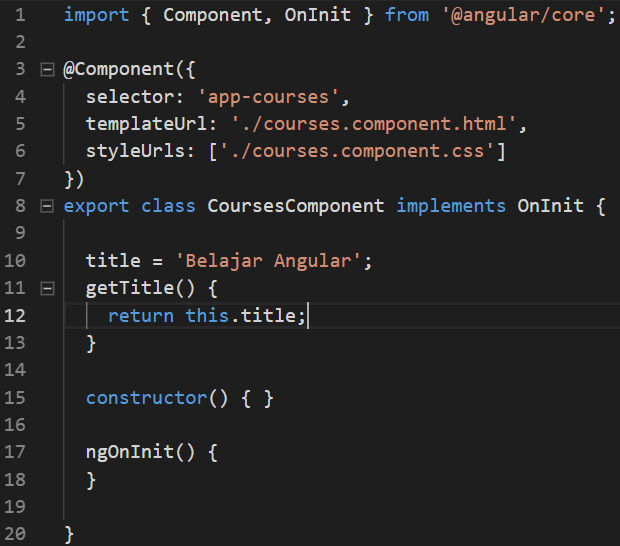

* Ubah code pada file **courses.component.html** seperti berikut:

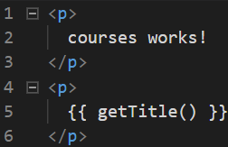

* Hasilnya seperti berikut:

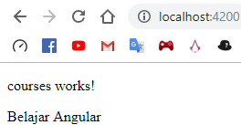

Praktikum - Bagian 3: Directive
---

* Buka file **courses.component.ts** dan membuat property dengan nama **course** dengan data berupa array. Seperti berikut:

```typescript
import { Component, OnInit } from '@angular/core';

@Component({
  selector: 'app-courses',
  templateUrl: './courses.component.html',
  styleUrls: ['./courses.component.css']
})
export class CoursesComponent implements OnInit {

  title = 'Belajar Angular';
  Title() {
    return this.title;
  }
  Courses = [
    {id: 0, name: 'HTML'},
    {id: 1, name: 'PHP'},
    {id: 2, name: 'ANGULAR'},
    {id: 3, name: 'C#'},
    {id: 4, name: 'VB.NET'}
  ]

  constructor() { }

  ngOnInit() {
  }

}
```

* Buka file **courses.component.html** lalu ditambahkan directive ` ngFor ` dan string interpolation seperti berikut:

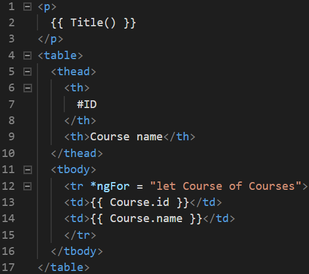

* Hasil pada browser:

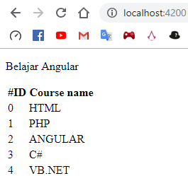

Praktikum - Bagian 4: Services dan Dependency Injection
---

* Membuat service baru yang bernama **courses** dengan perintah ` ng g s courses `.

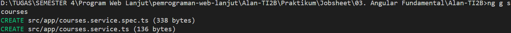

* Buka file **courses.service.ts** kemudian ditambahkan method getCourse seperti berikut:

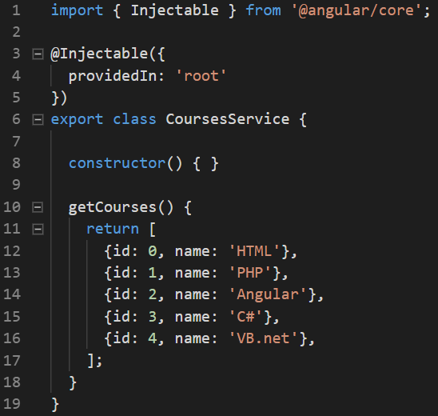

* Kemudian memodifikasi file **courses.component.ts** seperti berikut:

```typescript
import { Component, OnInit } from '@angular/core';

@Component({
  selector: 'app-courses',
  templateUrl: './courses.component.html',
  styleUrls: ['./courses.component.css']
})
export class CoursesComponent implements OnInit {

  title = 'Belajar Angular';
  Title() {
    return this.title;
  }
  Courses;

  constructor() { }

  ngOnInit() {
  }

}
```

* Hasilnya seperti berikut:

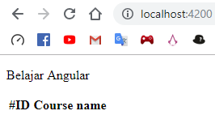

* Menambahkan constructor seperti berikut:

```typescript
import { Component, OnInit } from '@angular/core';
import { CoursesService } from '../courses.service';

@Component({
  selector: 'app-courses',
  templateUrl: './courses.component.html',
  styleUrls: ['./courses.component.css']
})
export class CoursesComponent implements OnInit {

  title = 'Belajar Angular';
  Title() {
    return this.title;
  }
  Courses;

  constructor(private service:CoursesService) { 
    this.Courses = service.getCourses;
  }

  ngOnInit() {
  }

}
```

* Hasilnya seperti berikut:


