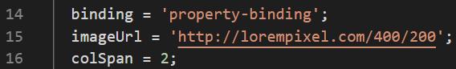

# 04. Displaying Data And Binding Data

Praktikum - Bagian 1: Component Basic
---

* Buka file **courses.component.ts** kemudian tambahkan code seperti berikut:

```typescript
import { Component, OnInit } from '@angular/core';
import { CoursesService } from '../courses.service';

@Component({
  selector: 'app-courses',
  templateUrl: './courses.component.html',
  styleUrls: ['./courses.component.css']
})
export class CoursesComponent implements OnInit {

  Title = 'Belajar Angular';
  Courses;

  binding = 'property-binding';
  imageUrl = 'http://lorempixel.com/400/200';

  constructor(private service:CoursesService) { 
    this.Courses = service.getCourses;
  }

  ngOnInit() {
  }

}

```

* Buka file **courses.component.html** lalu tambahkan code seperti berikut:

```html
<p>
  {{ Title }}
</p>
<table>
  <thead>
    <th>
      #ID
    </th>
    <th>Course name</th>
  </thead>
  <tbody>
    <tr *ngFor = "let Course of Courses">
    <td>{{ Course.id }}</td>
    <td>{{ Course.name }}</td>
    </tr>
  </tbody>
</table>

<h2>{{ binding }}</h2>
<h2 [textContent]='binding'></h2>


```

* Lalu hasilnya seperti ini:


Praktikum - Bagian 2: Attribute Binding
---

* Buka file **courses.component.ts** kemudian tambahkan property colspan dibawah line imageUrl seperti berikut:



* Buka file **courses.component.html** kemudian menambah code berikut:


* Lalu error akan muncul seperti ini:


* Menambahkan code untuk memperbaiki error seperti berikut:


* Kemudian menambah button pada file **courses.component.html** seperti berikut:


* Hasilnya seperti berikut:


Praktikum - Bagian 3: Class Bagian
---

* Buka file **courses.component.ts** kemudian menambah propery `isActive =  true` setelah line ` colspan = 2; `.


* Kemudian rubah ` isActive ` menjadi **false** dan inspect element maka kondisi active akan hilang.

> Mengubah ` isActive ` menjadi false.

 

* Hasilnya seperti berikut: 


Praktikum - Bagian 4: Style Binding
---

* Buka file **courses.component.html** kemudian menambah kode berikut:

```html
<button type = 'button' class = "btn btn-primary" [style.backgroundColor] = "isActive?'blue':'white'" > Tambah </button>
```

* Hasilnya seperti berikut


Praktikum - Bagian 5: Event Binding
---

* Buka file **courses.component.ts** lalu membuat method dengan nama ` onSave() `.


* Buka file **courses.component.html** lalu menambahkan even click.

```html
<button type = "button" class = "btn btn-default" (click) = "onSave()"> Button </button>
```

* Hasilnya seperti berikut:


* Buka file **courses.component.ts** kemudian menambahkan event ` $event `.


* Menambahkan code pada **courses.component.html**:

```html
<button type = "button" class = "btn btn-danger" (click) = "onSave($event)"> Button </button>
```

* Dan hasilnya seperti berikut:


* Membuat method ` onDivClick() ` pada **courses.component.ts**:


* Menambahkan div dan event binding pada div element:

```html
<div (click) = "onDivClick($event)">
  <button type = "button" class = "btn btn-danger" (click) = "onSave($event)"> Button </button>
</div>
```

* Hasilnya seperti berikut:


> **Penjelasan**: Console.log muncul 2 pesan ya itu mengenali method onDivClick() dan onSave() jadi kedua method akan terpanggil dalam ketukan pada button.

* Untuk mengatasi event bubbling, tambahkan ` $event.stopPropagation ` pada file **courses.component.ts**:


* Hasilnya seperti berikut:


> **Penjelasan**: Kegunaan dari stopPropagation() adalah untuk mengatasi terjadinya pengenalan pada event method selanjutnya (hanya pada parent method).

Praktikum - Bagian 6: Event Filtering
---

* Membuat inputan pada **courses.component.html** seperti berikut:

```html
<input type = "text" (keyup.enter) = "onKeyUp()">
```

* Menambahkan method ` onKeyUp `:


* Hasilnya seperti berikut:


Praktikum - Bagian 7: Template Variable
---

* Menambahkan variabel ` #nama ` pada **courses.component.html** :

```html
<input type = "text" #nama (keyup.enter) = "onKeyUp(nama.value)">
```

* Menambahkan parameter nama pada method ` onKeyUp() `:


* Hasilnya seperti berikut:


> **Penjelasan**: Jika kolom input diisi dengan text, lalu tekan enter, maka isi dari kolom tersebut akan muncul di console.

Praktikum - Bagian 8: Two Way Binding
---

* Membuat property baru dengan nama dan rubah parameter pada ` console.log `:


* Menambahkan parameter nama pada method ` onKeyUp() `:

```html
<input type = "text" [value] = 'nama' (keyup.enter) = "nama = $event.target.value;onKeyUp()">
```

* Hasilnya seperti berikut:


> **Penjelasan**: Isi dari atrribute nama akan di tampilkan pada kolom input dengan ` $event.target.value `.

* Buka file **app.module.ts** dan menambahkan formmodule seperti berikut:


* Buka **courses.component.html**, lalu memodifikasi codenya seperti berikut:


* Hasilnya seperti berikut:


> **Penjelasan**: ngModel membuat form control dari sebuah domain dan akan mem-bind menjadi form control element. (Untuk soal 11 dan 12 perbedaannya adalah pada soal 11 tidak terdapat ng-reflect-model, sedangkan 12 ada ng-reflect-model yang mana kolom tersebut sudah menjadi FormControl).