# 08. Reactive Form

Praktikum - Bagian 1: Building a Bootstrap Form
---

* Membuat component baru dengan nama `signup-form` dengan perintah sebagai berikut:

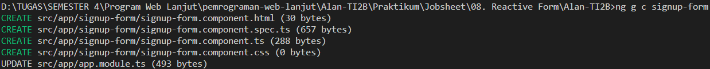

* Memodifikasi **app.component.html** menjadi seperti berikut:


* Memodifikasi filr **signup-form.component.html** menjadi seperti berikut:

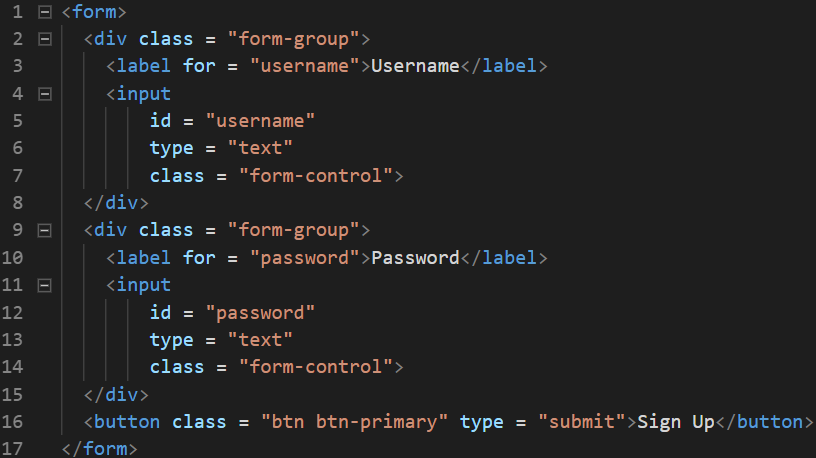

* Hasilnya seperti berikut:


Praktikum - Bagian 2: Control Programmatically
---

* Memodifikasi file **sign-up-form.component.ts** seperti berikut:

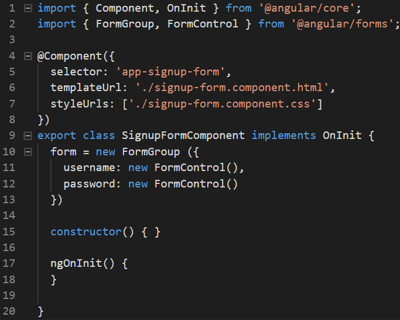

* Memodifikasi file **sign-up-form.component.html** seperti berikut:


* Maka akan muncul error seperti berikut:


* Memodifikasi file **app.module.ts** seperti berikut:


Praktikum - Bagian 3: Adding Validation
---

* Memodifikasi file **signup-form.component.ts** menjadi seperti berikut:

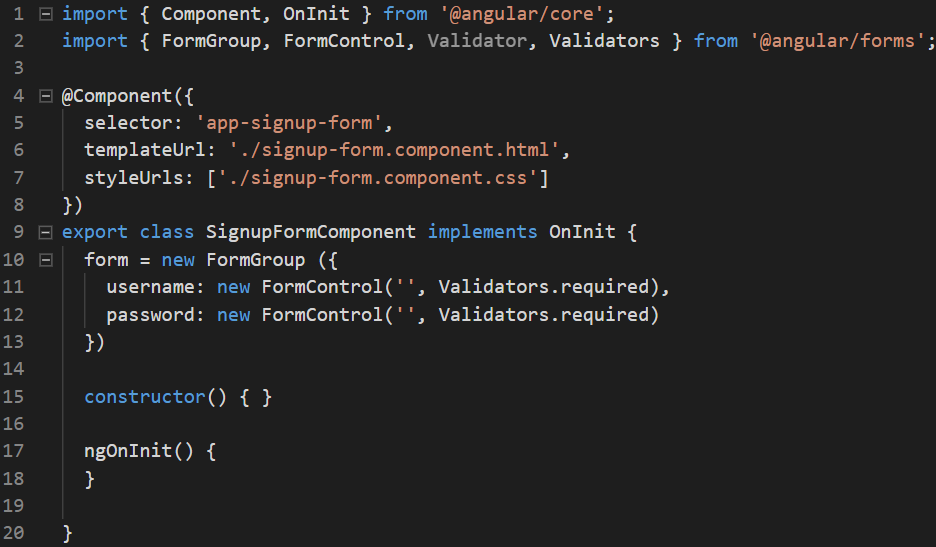

* Memodifikasi file **sign-up-form.component.html** seperti berikut:

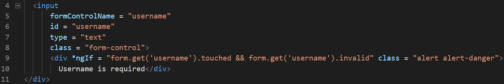

* Hasilnya seperti berikut:


* Menambahkan `get username` pada file **signup-form.component.ts** seperti berikut:

```typescript
  get username() {
    return this.form.get('username');
  }
```

* Memodifikasi file **sign-up-form.component.html** seperti berikut:

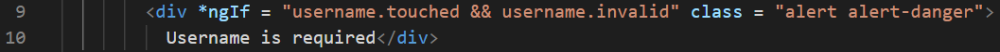

* Hasilnya seperti berikut:


Praktikum - Bagian 4: Specific Validation Errors
---

* Memodifikasi file **signup-form.component.ts** menjadi seperti berikut:


* Memodifikasi file **sign-up-form.component.html** seperti berikut:


* Hasilnya seperti berikut:


Praktikum - Bagian 5: Custome Validation
---

* Membuat file baru pada folder `signup-form` dengan nama **username.validators.ts** kemudian isi dengan script sebagai berikut:


* Memodifikasi file **signup-form.component.ts** menjadi seperti berikut:

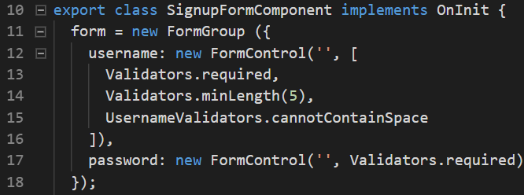

* Memodifikasi file **sign-up-form.component.html** seperti berikut:


* Hasilnya seperti berikut:


Praktikum - Bagian 6: Asyncronus Validation
---

* Memodifikasi file **username.validators.ts** menjadi seperti berikut:

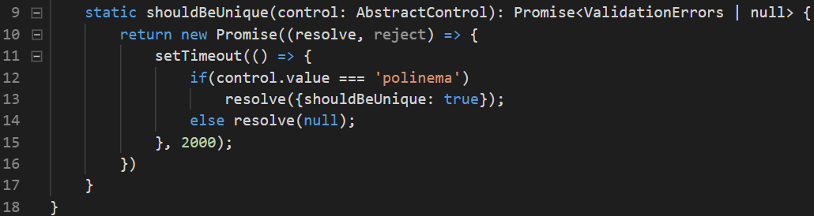

* Memodifikasi file **signup-form.component.ts** menjadi seperti berikut:

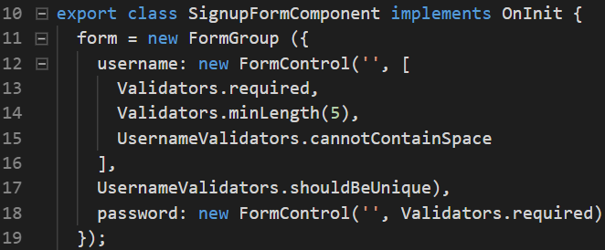

* Memodifikasi file **sign-up-form.component.html** seperti berikut:


* Hasilnya seperti berikut:


Praktikum - Bagian 7: Displaying a Loader Image
---

* Memodifikasi file **sign-up-form.component.html** seperti berikut:

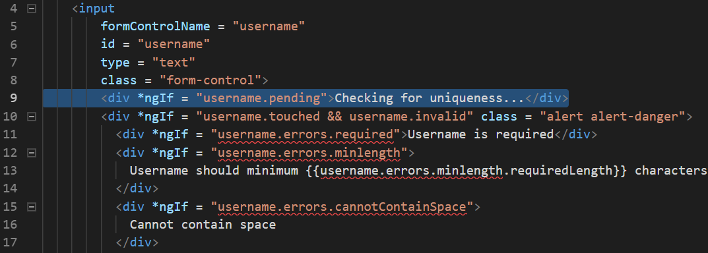

* Hasilnya seperti berikut:

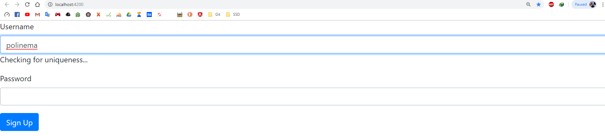

Praktikum - Bagian 8: Validating Form on Submit

* Memodifikasi file **signup-form.component.ts** menjadi seperti berikut:

```typescript
  login() {
    this.form.setErrors({
      invalidLogin: true
    });
  }
```

* Memodifikasi file **sign-up-form.component.html** seperti berikut:


* Hasilnya seperti berikut:

