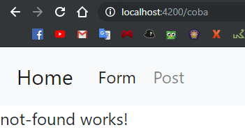

# 10. Routes

Praktikum - Bagian 1: Configure the Routes
---

* Membuat komponen posts, form-member, navbar, not-found, dan home

* Buka file **app.module.ts**. Memastikan komponen pada langkah 1 sudah terdaftar seperti berikut:

* Menambahkan module router pada file **app.module.ts** seperti berikut:

* Buka file **navbar.component.html** kemudian menambahkan code sebagai berikut:

* Buka file **navbar.component.html** kemudian ganti code menjadi sebagai berikut:

* Hasilnya seperti berikut:

Praktikum - Bagian 2: Router Outlet
---

* Buka file **app.component.html** kemudian menambahkan code sebagai berikut:

* Hasilnya seperti berikut:

* Inspect Element:

> app-navbar berhasil di jalankan

* Menjalankan link **localhost:4200/form** 

* Menjalankan link **localhost:4200/post** 

* Menjalankan link **localhost:4200/coba** 

> Penjelasan langkah 3, 4 dan 5: Membuat beberapa outlet untuk link. Setiap link mempunyai component sendiri kecuali link **localhost:4200/coba** karena tidak dibuatkan component

Praktikum - Bagian 3: Add Link
---

* Buka file **navbar.component.html** kemudian menambahkan link pada href tiap menu seperti berikut:

> Jika klik navbar home dan post, maka link akan berubah menjadi .../home dan .../post

* Memodifikasi href menjadi routerLink pada halaman **navbar.component.html** seperti berikut:

* Hasilnya seperti berikut:

* Memodifikasi class li pada file **navbar.component.html** menjadi seperti berikut:

* Hasilnya seperti berikut:

Praktikum - Bagian 4: Accessing Route Parameter
---

* Membuat komponen baru bernama **profile** dengan perintah `ng g c profile`

* Buka file **app.module.ts** kemudian menambahkan route untuk profile sebagai berikut:

* Buka file **home.component.html** kemudian menambahkan code sebagai berikut:

* Modifikasi file **profile.component.ts** menjadi seperti berikut:

* Hasilnya seperti berikut:

> Link Joko Bowo mempunyai id, yang terletak pada routerLink

* Modifikasi file **profile.component.ts** menjadi seperti berikut:

* Hasilnya seperti berikut:

