# 11. Authentication and Authorization

Praktikum - Bagian 1: Implementation Login
---

* Membuka folder **auth-demo-starter**

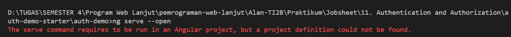

* Menginstall angular2-jwt dengan perintah `npm install angular2-jwt --save`:

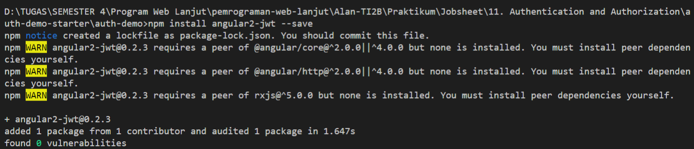

* Hasilnya seperti berikut:

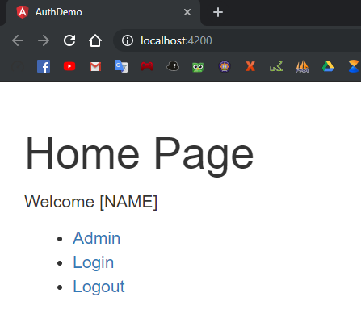

* Membuka file **auth.service.ts** kemudian menambahkan code seperti berikut:

* Mengisi email dan password pada login.

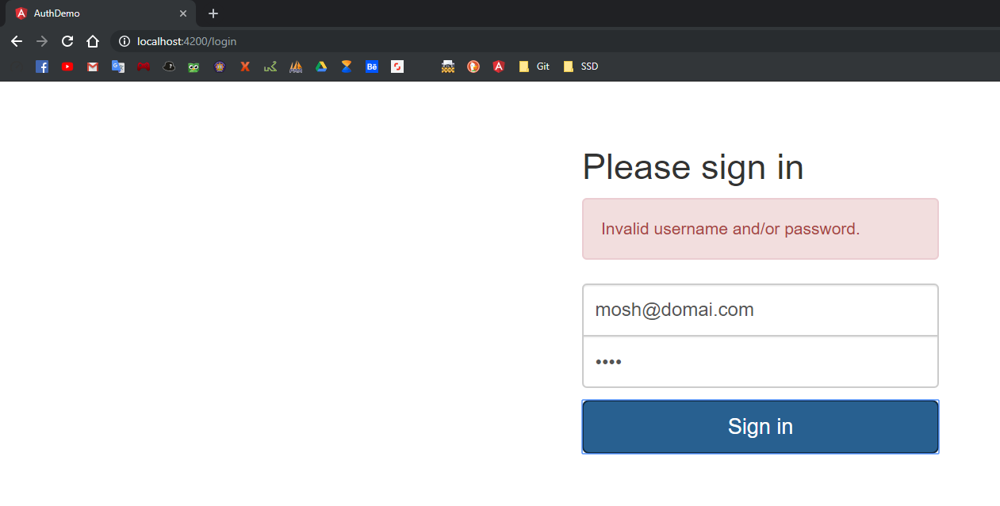

* Mengisi email dengan format yang salah

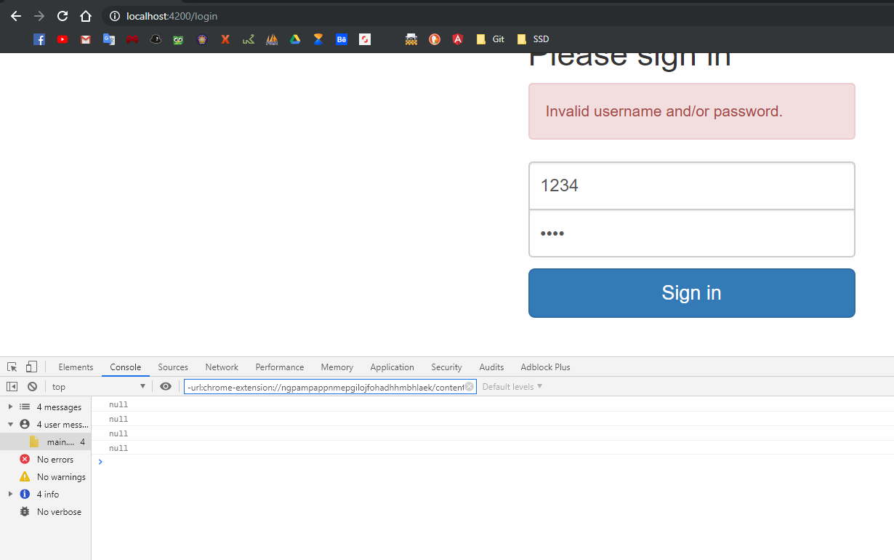

* Membuka file **auth.service.ts** kemudian ganti code menjadi sebagai berikut:

* Hasilnya seperti berikut:

Praktikum - Bagian 2: Implementasi Logout
---

* Membuka file **home.component.html** kemudian menambahkan code seperti berikut:

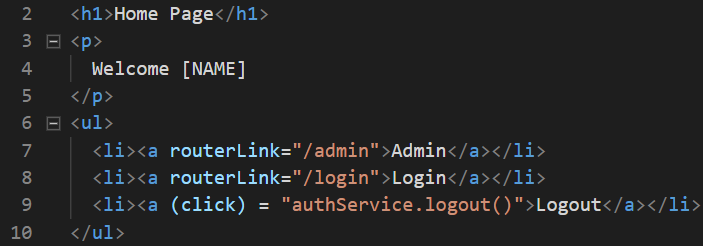

* Membuka file **auth.service.ts** kemudian menambahkan code seperti berikut:

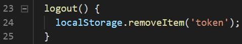

* Hasilnya seperti berikut:

Praktikum - Bagian 3: Getting the Current User
---

* Membuat token di jwt.io

* Membuka file **auth.service.ts** kemudian ganti code menjadi sebagai berikut:

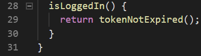

* Membuka file **auth.service.ts** kemudian menambahkan code seperti berikut:

* Membuka file **auth.service.ts** kemudian ganti token menjadi berikut:

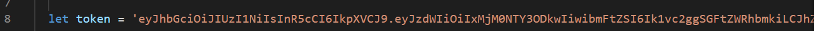

* Membuka file **home.component.html** kemudian ganti code menjadi sebagai berikut:

* Halaman awal

* Login seperti yang sudah di tentukan

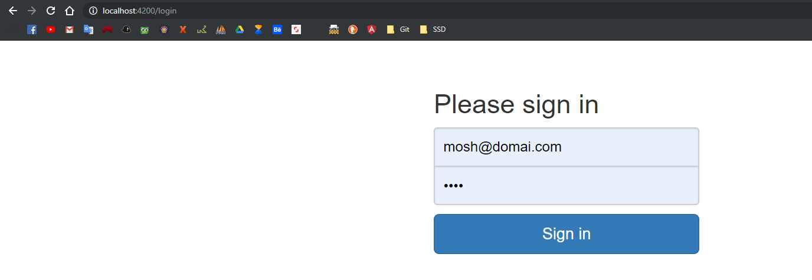

* Token akan tersimpan

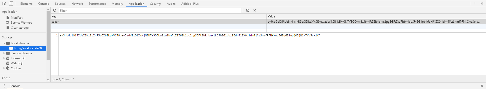

* Nama akan berubah sesuai login

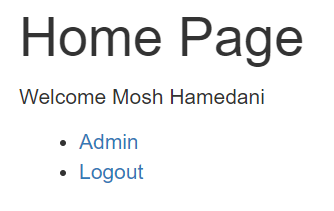

* Halaman admin

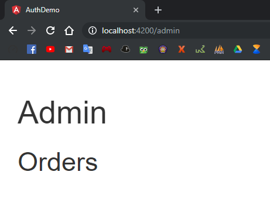

* Logout maka token akan hilang

> Penjelasan : Kita masuk sebagai admin (token yang sudah dibuat adalah user sebagai admin), jadi jika kita login, dengan user itu, maka halaman admin akan terbuka. Dan jika di logout maka token akan hilang.